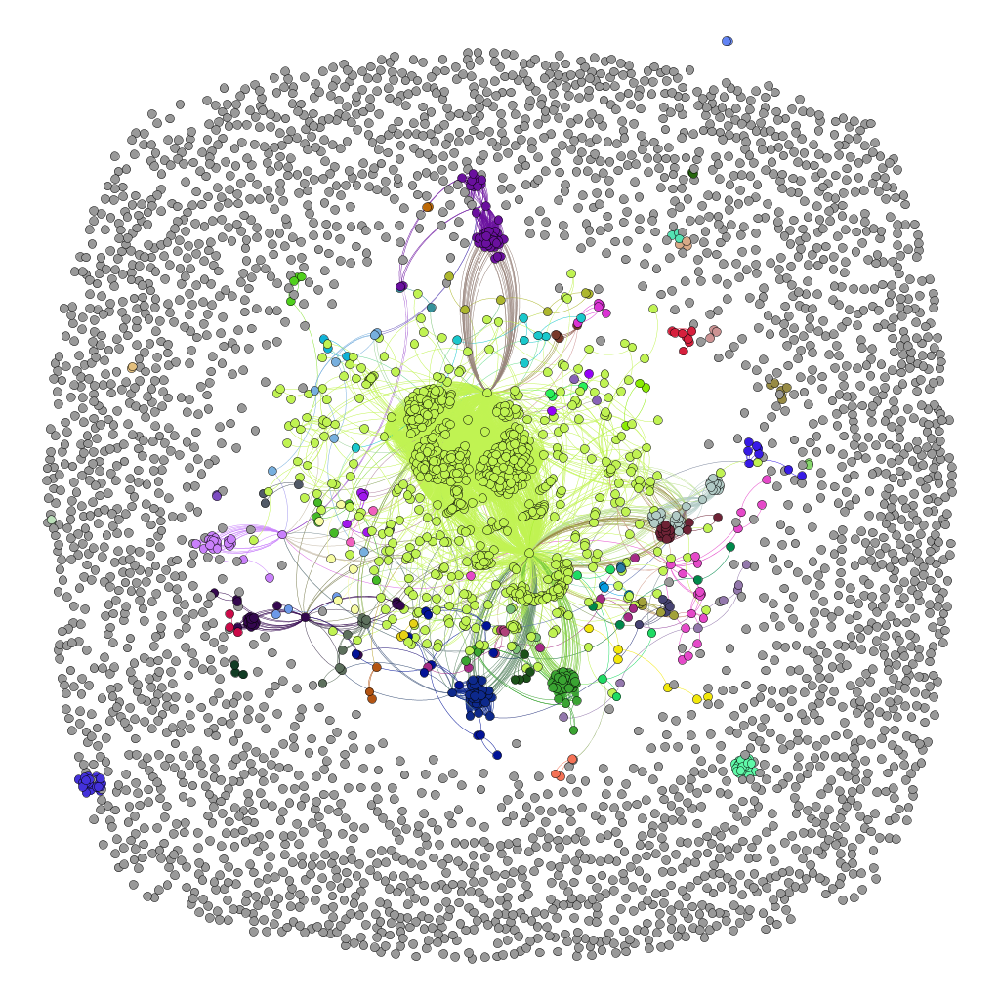

# Malware Classifier From Network Capture

*Malware Classifier* is a simple free software project done during an [university workshop of 4 hours](http://www.foo.be/cours/dess-20142015/Redis-Introduction.pdf). The objective of the 4 hours workshop was to introduce network forensic and simple techniques to classify malware network capture (from their execution in a virtual machine). So the software was kept very simple while using and learning existing tools ([networkx](https://networkx.github.io/), [redis](http://www.redis.io/) and [Gephi](http://gephi.github.io/)).

## Requirements

 * Python 2.7
 * networkx and redis modules (pip install -r REQUIREMENTS)
 * tshark (part of Wireshark)
 * a Redis server

# How to use the Malware Classifier

You'll need of a set of network packet captures. In the workshop, we use a dataset with more than 5000 pcap files generated from the execution of malware in virtual machines.

```
...
0580c82f6f90b75fcf81fd3ac779ae84.pcap
05a0f4f7a72f04bda62e3a6c92970f6e.pcap
05b4a945e5f1f7675c19b74748fd30d1.pcap
05b57374486ce8a5ce33d3b7d6c9ba48.pcap
05bbddc8edac3615754f93139cf11674.pcap
...
```

The filename includes the MD5 malware executed in the virtual machine.

If you want to classify malware communications based on the Server HTTP headers of the (potential) C&C communication.

```shell
cd capture
ls -1 . | parallel --gnu "cat {1} | tshark -E header=yes -E separator=, -Tfields -e http.server -r {1} | python ./bin/import.py  -f {1} "
```

You can add additional attributes like any fields from the dissectors available within tshark (tshark -G fields). You can add additional fields in the command above. This will update the redis data structure. Then when you have enough attributes, you can dump a graph out of the relationships between the attributes and the malware packet captures.

```shell
python ./bin/graph.py
```

graph.py generates a GEXF file that you can import in [gephi](https://gephi.org).

The output in Gephi can look like this:



## Redis data structure


## Notes for the student

Check the git log and the commits, these include the steps performed during the workshop especially regarding the improvement of the Python scripts.

## Slides of the training session

[Classifying malware using network traffic analysis.  Or how to learn Redis, git, tshark and Python in 4 hours.](https://www.foo.be/cours/dess-20162017/pub/Redis-Introduction.pdf)
